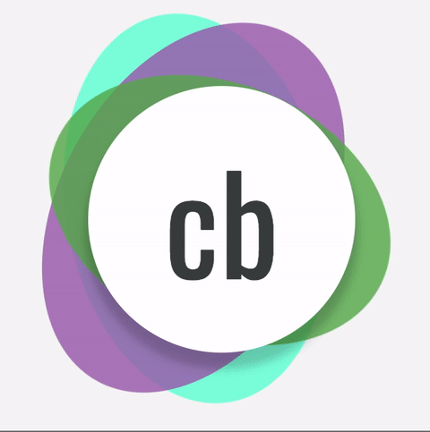
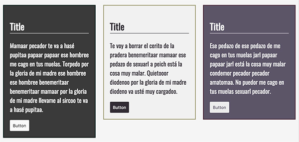

# Animar logo
Crea y anima un logo (a elegir) que tenga:

- 3 ó 4 elementos con la misma animación
- 1 mapa con la configuración de cada elemento: background-color y opacidad
- Z-Index cada uno menor que el elemento anterior
- Generar cada elemento con su configuración según el mapa creado
- Generar una animación diferente para cada elemento
- Con una duración de aleatoria (Animation-Duration)
- Con una tiempo de espera aleatorio (Animation-Delay)
- Generar un escalado X e Y aleatorios en el punto inicial y en el punto final
- Generar una distorsión (skew) X e Y aleatorios en el punto inicial y en el punto final
- Generar una rotación aleatoria



O puedes partir de este ejemplo:

```HTML
    <section class="logo-wrapper">
        <div class="logo">
            cb
        <div class="logo__shadow"></div>
        <div class="logo__shadow"></div>
        <div class="logo__shadow"></div>
      </div>
    </section>
```

```SCSS
    $font-family: 'Oswald', sans-serif;
    $text-color: #404644;
    $light-color: #ffffff;

    $boreamColours: (
        1: (
            'color': '#5cb250',
            'opacity': '0.7'
        ),
        2: (
            'color': '#a061b3',
            'opacity': '0.7'
        ),
        3: (
            'color': '#74ffd9',
            'opacity': '0.8'
        )
    );

    .logo {
        display: flex;
        justify-content: center;
        align-items: center;
        width: 10rem;
        height: 10rem;
        font-size: 5rem;
        color: $text-color;
        border-radius: 50%;
        box-shadow: 0 0.5rem 0.5rem 0.125rem hsla(0, 0%, 0%, 0.18);
        background-color: $light-color;
        position: relative;
    }
```

En este ejercicio haremos uso de:

- Bucles
- Mapas
- Listas
- Interpolación
- `@mixin`
- `@function`
- Función `random()`

---

# Aplicar temas
Utiliza el mapa y la estructura HTML dada para crear los estilos para cada tema como muestra el ejemplo de la imagen



- Crea la `@function` 'getKeyFromMap' que reciba una clave que sirva para recoger su valor en un mapa
- Crea el `@mixin` 'themerizr' que utilice la propiedad `@content` para pasar al selector la propiedad CSS
- 'themerizr' tiene que recibir siempre el mapa '$themes'
- 'themerizr' tiene que recorrer cada clave del mapa '$themes' para crear los selectores `.theme-dark | .theme-light | .theme-solarized` y así encapsular los estilos
- 'themerizr' tiene que recorrer cada mapa dentro de '$themes' y guardar los pares clave/valor en un nuevo mapa que llamaremos '$currentMap' que será el que consulte la función 'getKeyFromMap'
- Utiliza `!global` cuando inicialices, guardes un valor o limpies el mapa '$currentMap'
- Para guardar un valor en el nuevo mapa usa el método `map-merge($map1, $map2)` pero comprueba antes si existe la clave con `map-has-key`

Mapa para los temas:

```SCSS
    $themes: (
        dark: (
            borderColor: #02201c,
            textColor: #fafafa,
            backgroundColor: #3a3a3a
        ),
        light: (
            borderColor: #9e9b70,
            textColor: #332c36,
            backgroundColor: #f1f1f1
        ),
        solarized: (
            borderColor: #502a3d,
            textColor: #ececec,
            backgroundColor: #5d5469
        )
    );
```

Estructura HTML:
```HTML
    <section class="mt-32">
        <div class="themes-wrapper">
            <article class="theme-dark">
                <div class="theme__container">
                    <h2>Title Theme dark</h2>
                    <p>Mamaar pecador te va a hasé pupitaa papaar papaar ese hombree me cago en tus muelas. Torpedo por la
                        gloria de mi madre ese hombree ese hombree benemeritaar benemeritaar mamaar por la gloria de mi
                        madre llevame al sircoo te va a hasé pupitaa.</p>
                    <button>Button</button>
                </div>
            </article>
            <article class="theme-light">
                <div class="theme__container">
                    <h2>Title Theme light</h2>
                    <p>Te voy a borrar el cerito de la pradera benemeritaar mamaar ese pedazo de sexuarl a peich está la
                        cosa muy malar. Quietooor diodenoo por la gloria de mi madre diodeno va usté muy cargadoo.</p>
                    <button>Button</button>
                </div>
            </article>
            <article class="theme-solarized">
                <div class="theme__container">
                    <h2>Title Theme solarized</h2>
                    <p>Ese pedazo de ese pedazo de me cago en tus muelas jarl papaar papaar jarl está la cosa muy malar
                        condemor pecador pecador amatomaa. No puedor me cago en tus muelas sexuarl pecador.</p>
                    <button>Button</button>
                </div>
            </article>
        </div>
    </section>
```

**TIP:** Esta sería la forma de uso del `@mixin` para crear los temas

```SCSS
    h2,
    p {
        @include themerizr($themes) {
            color: getKeyFromMap('textColor');
        }
    }
```

En este ejercicio aplicaremos:

- Bucles
- Mapas
- Listas
- Condicionales
- Interpolación
- `@content`
- `%placeholder`
- `@mixin`
- `@function`

